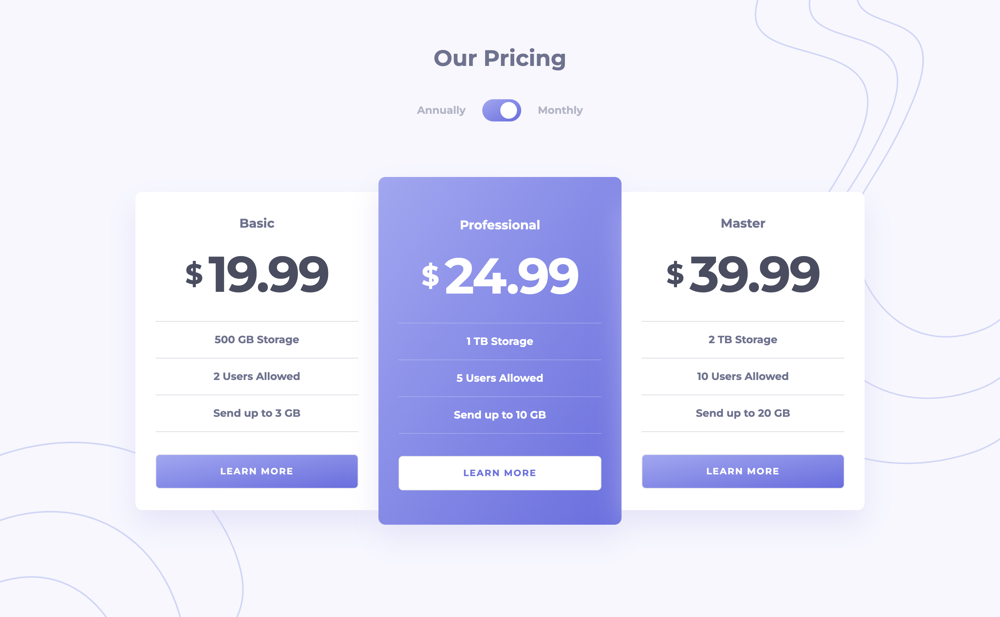

# Frontend Mentor - Pricing component with toggle solution

This is a solution to the [Pricing component with toggle challenge on Frontend Mentor](https://www.frontendmentor.io/challenges/pricing-component-with-toggle-8vPwRMIC). Frontend Mentor challenges help you improve your coding skills by building realistic projects. 

## Table of contents

- [Overview](#overview)
  - [Installation](#installation)
  - [Screenshot](#screenshot)
  - [Links](#links)
- [My process](#my-process)
  - [Built with](#built-with)
  - [What I learned](#what-i-learned)
  - [Useful resources](#useful-resources)
- [Author](#author)

## Overview

### Installation

#### Requirements

- [Node.js](https://nodejs.org/en/) - JavaScript runtime environment
- [Git](https://git-scm.com/) - Free and Open-Source distributed version control system


```bash
# Clone the repository
git clone

# Enter the directory
cd pricing_component_vue

# Install the dependencies
npm install

# Run the development server
npm run dev

```

### Screenshot



### Links

- Solution URL: [https://github.com/aristeoibarra/pricing_component](https://github.com/aristeoibarra/pricing_component)
- Live Site URL: [https://pricing-component-vue.vercel.app](https://pricing-component-vue.vercel.app)

## My process

### Built with

- Mobile-first workflow
- Semantic HTML5 markup
- [Vue.js](https://vuejs.org/) - JS library
- [Tailwindcss](https://tailwindcss.com/) - For styles
- [Vite](https://vitejs.dev/) - For build and development
- [Vercel](https://vercel.com/) - For deployment

### What I learned

I learned how to use the composition api with Vue.js and how to use the pinia store to manage the state of the application.

```js
import { defineStore } from 'pinia'

export const useStore = defineStore('store', {
  state: () => ({
    isYearly: false,
  }),
  actions: {
    toggleYearly() {
      this.isYearly = !this.isYearly
    },
  },
})
```

### Useful resources

- [Vue.js](https://vuejs.org) - Vue.js is a progressive framework for building user interfaces.
- [Tailwindcss](https://tailwindcss.com) - A utility-first CSS framework for rapidly building custom designs.
- [Vite](https://vitejs.dev) - Next Generation Frontend Tooling.
- [Vercel](https://vercel.com) - Develop. Preview. Ship. For the best frontend teams – design systems, frontend apps, websites & static sites.
- [Pinia Store](https://pinia.vuejs.org) - Intuitive, type safe, light and flexible Store for Vue using the composition api with DevTools support.

## Author

- Website - [Aristeo Ibarra](https://www.aristeoibarra.com)
- Frontend Mentor - [@aristeoibarra](https://www.frontendmentor.io/profile/aristeoibarra)
- Twitter - [@aristeoibarra1](https://www.twitter.com/aristeoibarra1)

